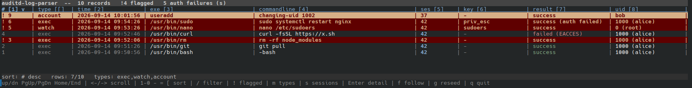
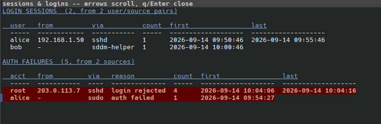

# auditd-log-parser

A single-file terminal viewer for Linux **auditd** logs. It reads the raw
`/var/log/audit/audit.log` format — not the `ausearch`-interpreted one — and
shows almost everything auditd records as one sortable, filterable table:
process executions, file-integrity watches, account/service/config changes,
kernel-flagged anomalies. Login sessions and authentication get their own
view instead, since they're naturally a summary rather than one row each.

- **No dependencies.** Pure Python 3 standard library (`curses`, `pwd`, `grp`, `gzip`).
- **One file.** Copy it to a box and run it — nothing to install, nothing to build.
- **One table, every record.** Executions, the non-`execve` syscalls a custom
  rule tagged with `-k` (file-integrity watches on `/etc/passwd`, `sudoers`,
  cron, …), account/group changes, service start/stop, auditd's own rule
  changes, kernel anomalies — a `type` column says which, and a checkbox menu
  (`m`) shows or hides each kind.
- **Flags what looks dangerous**: recursive `rm`, disk wipes, `curl | sh`,
  disabling auditd/the firewall, editing `sudoers`/`shadow`/`authorized_keys`,
  reverse shells, a failed account change, any kernel anomaly, tampering with
  auditd's own configuration, and a `sudo`/`su`/`doas` command whose password
  was actually wrong even though the process itself launched fine.
- **Reconstructs login sessions** — who logged in, from where — and collects
  every failed authentication attempt, grouped so a brute-force is one line.

## Requirements

- Linux with `auditd` running, and at least one rule that records executions:
  ```
  -a always,exit -F arch=b64 -S execve -S execveat -k exec
  ```
- Python **3.7+** — standard library only, nothing to `pip install`.
- Read access to the log, usually via `sudo` (auditd logs are root-only by default).

## Install

```sh
curl -L -o auditd-log-parser https://raw.githubusercontent.com/lab5terr/auditd-log-parser/main/auditd-log-parser.py
chmod +x auditd-log-parser
sudo ./auditd-log-parser
```

Optionally put it on root's `PATH` — `/usr/local/sbin` is the FHS location
for locally-added system-administration tools:

```sh
sudo install -m 755 auditd-log-parser /usr/local/sbin/
```

Or just clone the repo:

```sh
git clone https://github.com/lab5terr/auditd-log-parser.git
```

## Example audit rules

The tool reads whatever `auditd` already logs — it doesn't need any specific
rule set — but it's only as useful as the rules feeding it. A minimal,
practical set for `/etc/audit/rules.d/`:

```
# every process execution
-a always,exit -F arch=b64 -S execve -S execveat -k exec

# privilege escalation itself
-a always,exit -F path=/usr/bin/sudo -F perm=x -F key=priv_esc
-a always,exit -F path=/bin/su       -F perm=x -F key=priv_esc

# file-integrity watches -- these don't touch execve at all, so without
# auditd-log-parser's "watch" rows they'd be invisible in a process-only view
-a always,exit -F path=/etc/passwd  -F perm=wa -F key=identity
-a always,exit -F path=/etc/shadow  -F perm=wa -F key=identity
-a always,exit -F path=/etc/group   -F perm=wa -F key=identity
-a always,exit -F path=/etc/sudoers -F perm=wa -F key=sudoers
-a always,exit -F dir=/root/.ssh/   -F perm=wa -F key=root_ssh_keys
-a always,exit -F dir=/etc/audit/   -F perm=wa -F key=audit_config
```

Reload with `auditctl -R /etc/audit/rules.d/50-local-security.rules` (or
restart `auditd`). Any rule's `-k <key>` shows up verbatim in the `key`
column, so you can group or filter (`/`) on it later.

## Usage

```
auditd-log-parser [LOGFILE ...]        open the TUI (default: /var/log/audit/audit.log)
auditd-log-parser -f                   follow the newest log, appending events live
auditd-log-parser 'audit.log*'         parse rotated logs too (oldest first; .gz ok)
auditd-log-parser -                    read the raw log from stdin

auditd-log-parser --plain              print an aligned table and exit
auditd-log-parser --plain --sort time -r --full
auditd-log-parser --plain --flagged    only sessions containing a flagged command
auditd-log-parser --color light        palette for a light terminal
```

`--plain` output is pipe-friendly; flagged rows are prefixed with `!` in the
`#` column and coloured red when stdout is a TTY.

## The main table

One row per record, newest first by default. A `!` in `#` and a red row mean
`classify_danger()` flagged it (see below); `type` says what kind of record
it is — `exec`, `watch`, `account`, `service`, `config`, or `anomaly`.



```text
auditd-log-parser  --  5 records   !2 flagged
# [1] v  | type [[]  | time [2]            | exe [3]                        | commandline [4]                                | ses [5]    | key [6]            | result [7]             | uid [8]              | parent command [9]   | parent exe [0]               | pid [-]    | ppid [=]
! 5      | watch     | 2026-09-14 12:00:00 | /usr/bin/nano                  | nano /etc/sudoers                              | 42         | sudoers            | success                | 0 (root)             | -bash                | /usr/bin/bash                | 906        | 902
4        | exec      | 2026-09-14 11:59:19 | /usr/bin/curl                  | curl -fsSL https://x.sh                        | 42         | -                  | failed (EACCES)        | 0 (root)             | -bash                | /usr/bin/bash                | 905        | 902
! 3      | exec      | 2026-09-14 11:58:40 | /usr/bin/rm                    | rm -rf node_modules                            | 42         | -                  | success                | 1000 (alice)         | -bash                | /usr/bin/bash                | 904        | 902
2        | exec      | 2026-09-14 11:58:02 | /usr/bin/git                   | git pull                                       | 42         | -                  | success                | 1000 (alice)         | -bash                | /usr/bin/bash                | 903        | 902
1        | exec      | 2026-09-14 11:57:44 | /usr/bin/bash                  | -bash                                          | 42         | -                  | success                | 1000 (alice)         | sshd                 | /usr/sbin/sshd               | 902        | 941
sort: # desc   rows: 5/5   types: exec,watch,account
up/dn PgUp/PgDn Home/End | <-/-> scroll | 1-0 - = [ sort | / filter | ! flagged | m types | s sessions | Enter detail | f follow | g reseed | q quit
```

Row 5 (`nano /etc/sudoers`) isn't an `execve` — it's a plain `openat` syscall
that the `sudoers` file-watch rule above tagged, shown as `type: watch` and
flagged exactly like a dangerous command, because `classify_danger()` runs on
every row's reconstructed command the same way regardless of `type`.

The table scrolls horizontally (`←`/`→`) to reveal `parent command`,
`parent exe`, `pid` and `ppid` on a narrow terminal.

### A `sudo` command whose password was wrong

A `sudo`/`su`/`doas` process's own `execve()` always succeeds the instant it
launches — that's a kernel fact, unrelated to whether the password typed
into it checks out. Left alone, a rejected password would just look like a
clean `success`. The tool cross-references the process's own authentication
outcome (same pid) and, when the final attempt was a rejection, flags the row
and annotates its result:

```text
auditd-log-parser  --  1 records   !1 flagged   1 auth failures (s)
# [1] v  | type [[]  | time [2]            | exe [3]                        | commandline [4]                                | ses [5]    | key [6]            | result [7]             | uid [8]              | parent command [9]   | parent exe [0]               | pid [-]    | ppid [=]
! 1      | exec      | 2026-09-14 12:01:40 | /usr/bin/sudo                  | sudo systemctl restart nginx                   | 42         | priv_esc           | success (auth failed)  | 1000 (alice)         | -bash                | /usr/bin/bash                | 950        | 902
sort: # desc   rows: 1/1   types: exec,watch,account
up/dn PgUp/PgDn Home/End | <-/-> scroll | 1-0 - = [ sort | / filter | ! flagged | m types | s sessions | Enter detail | f follow | g reseed | q quit
```

If the same password prompt is retried and eventually accepted, the row is
**not** flagged — only the last outcome for that process counts, so a typo
followed by the correct password doesn't get reported as a denied escalation.

## Sessions & auth failures (`s`)

Login sessions and failed authentication live here instead of the main
table, because they naturally aggregate rather than list one row per record.
Both tables are grouped — logins by user + source (SSH forced-command setups
open one session per command), failures by account + source — so a
brute-force is one line, not two hundred:



```text
LOGIN SESSIONS  (12, from 1 user/source pairs)

  user  from          via   count  first                last
  ----  ------------  ----  -----  -------------------  -------------------
  root  80.66.245.39  sshd  12     2026-03-17 20:18:22  2026-03-17 20:22:22

  + 4 service / PAM-only sessions (systemd, su, sudo)

AUTH FAILURES  (243, from 31 sources)

  acct            from             via   reason          count  first                last
  --------------  ---------------  ----  --------------  -----  -------------------  -------------------
  (invalid user)  109.160.32.37    sshd  login rejected  143    2026-03-17 20:17:42  2026-03-17 20:22:21
  pengbo          109.160.32.37    sshd  auth failed     23     2026-03-17 20:17:58  2026-03-17 20:22:21
  panda           109.160.32.37    sshd  auth failed     18     2026-03-17 20:17:42  2026-03-17 20:21:49
  root            80.66.245.39     sshd  login rejected  12     2026-03-17 20:18:22  2026-03-17 20:22:22
```

Successful **`root`** logins are highlighted; `nspawn:` container rows are
dimmed. Column widths auto-fit their contents, so a lone IPv6 address widens
only its own column. Different distros populate different records —
`USER_LOGIN` on some, `USER_ACCT` on others, `USER_ERR` for rejections — and
all of them are used; hex-encoded account names (`acct="(invalid user)"`)
are decoded. A log with **no** execve records at all — a box that only
audits logins — still yields this view.

## Row-type menu (`m`)

Check or uncheck which kinds of record show in the main table. `service`,
`config` and `anomaly` start **off** — a single boot can add hundreds of
`SERVICE_START`/`SERVICE_STOP` rows and `CONFIG_CHANGE` rule reloads — turn
them on when you actually want them:

```text
record types shown in the main window
  [x] exec     process executions (execve)
  [x] watch    file / rule-tagged syscalls (identity, cron, sudoers, ...)
  [x] account  account & group changes
  [ ] service  service start / stop
  [ ] config   auditd rule & parameter changes
  [ ] anomaly  kernel-flagged anomalies
up/dn move | space toggle | a all | n none | Enter/q close
```

The status line shows `types: ...` whenever it isn't this default set. A
`service` row's `commandline` cell is split in two colours — the unit name,
then `started` in green or `stopped` dimmed — so a glance tells you which
without reading it.

## TUI keys

| Key | Action |
| --- | --- |
| `↑` `↓` `PgUp` `PgDn` `Home` `End` | move the row cursor |
| `←` `→` | scroll horizontally (main table, detail popup, and sessions view) |
| `1`–`9` `0` `-` `=` `[` | sort by that column (shown in brackets in its header; press again to reverse) |
| `Home` / `End` | jump to the top / bottom row, and follow it while new events arrive |
| `/` | filter rows by substring |
| `!` | toggle "show only sessions that contain a flagged command" |
| `m` | row-type menu: show/hide exec/watch/account/service/config/anomaly rows |
| `s` | sessions & auth-failures view |
| `Enter` | open the full record (all fields + raw log lines) |
| `f` | toggle live follow |
| `g` | re-seed parent info from `/proc` (live mode) |
| `q` | quit |

## Columns

| # | Column | Meaning |
| --- | --- | --- |
| 1 | `#` | arrival order, aligned to real timestamps; `!` marks a flagged row |
| 2 | `type` | `exec` / `watch` / `account` / `service` / `config` / `anomaly` |
| 3 | `time` | event timestamp (local) |
| 4 | `exe` | path of the executed binary (or the acting tool, for non-exec rows) |
| 5 | `commandline` | reconstructed `argv`, or a synthesized description for non-exec rows |
| 6 | `ses` | audit session id |
| 7 | `key` | audit rule key(s) |
| 8 | `result` | `success` / `failed (ERRNO)`, annotated `(auth failed)` where relevant |
| 9 | `uid` | numeric uid + resolved name |
| 10 | `parent command` | `comm` of the parent process |
| 11 | `parent exe` | `exe` of the parent process |
| 12 | `pid` | process id |
| 13 | `ppid` | parent process id |

## How it works

- **Record correlation.** auditd interleaves the records of concurrently
  running events, and the per-event serial number resets when the daemon
  restarts. Events are keyed by the full audit id (`timestamp:serial`) and
  assembled regardless of record order, so nothing is lost across reboots.
  A non-`execve` syscall only becomes a row if a custom rule tagged it with
  `-k`; an untagged one — the vast majority of what the kernel could audit —
  is dropped, so the table doesn't fill with incidental noise.
- **User / group names.** If the log is `ENRICHED`
  (`log_format = ENRICHED` in `auditd.conf`), the names auditd resolved on
  the originating host are used, so they're correct even under `sudo` or
  when the log came from another machine. Otherwise the local `passwd` /
  `group` database is consulted. A `systemd-nspawn` container UID
  (`vu-<machine>-0`, or a bare uid that's a multiple of 65536) is shown as
  `nspawn: <machine>`.
- **Parent process.** auditd doesn't record the parent's identity, so it's
  reconstructed by matching `ppid` against processes seen executing earlier
  in the log (and, in `--follow`, from a `/proc` scan at startup).
- **Sessions.** Rows sharing a `ses` get the same faint background. The
  flagged filter (`!` / `--flagged`) expands to the *whole* session of any
  flagged command, for context — except a `ses` of "unset" (most
  service/anomaly rows have none), which never sweeps in unrelated rows.
- **Logins & auth failures.** `LOGIN`/`USER_LOGIN`/`USER_START`/`USER_END`
  build the session table; `USER_ACCT` fills in the source on distros whose
  sshd doesn't emit `USER_LOGIN` (correlated by pid, within 60s). Failed
  `USER_AUTH`/`USER_ERR`/`USER_ACCT`/rejected `USER_LOGIN` become the AUTH
  FAILURES table, grouped by account + source; a trailing `bad_ident` that
  just tails an already-logged rejection is folded into it.
- **Everything else.** `USER_MGMT`/`GRP_MGMT`/`ADD_USER`/`DEL_USER`/etc.
  become `type: account`; `SERVICE_START`/`SERVICE_STOP` become
  `type: service`; `CONFIG_CHANGE` becomes `type: config`;
  `ANOM_PROMISCUOUS`/`ANOM_LOGIN_FAILURES`/`ANOM_ABEND` become
  `type: anomaly`. Use `m` or the `/` filter (on the `type` text) to narrow
  down which you're looking at.

## "Potentially dangerous" detection

`classify_danger()` flags a row when it matches heuristics for destructive or
security-relevant activity — recursive `rm`, `mkfs`/`wipefs`/`shred`, `dd` to
a raw device, `chmod 777`/recursive `chmod`/`chown`, piping a download into a
shell, base64-decode-and-execute, fork bombs, `/dev/tcp` reverse shells,
`nc -e`, account and password changes, editing `sudoers`, reading
`/etc/shadow`, touching `authorized_keys`, disabling SELinux/the
firewall/`auditd`, clearing shell history or logs, running a binary from a
world-writable directory, and more.

Some things are **always** flagged, regardless of success:

- Anything touching audit itself — running `auditctl`, any file under
  `/etc/audit`, every `CONFIG_CHANGE` row, the `auditd`/`audit-rules`
  services starting or stopping. Tampering with the audit trail is a classic
  way to cover tracks.
- A kernel-flagged anomaly (`type: anomaly`), or a failed account/group change.
- A `sudo`/`su`/`doas` row whose final password check was rejected (see above).

It is a **triage aid, not a verdict** — expect the occasional benign match
(a script whose text happens to contain `rm -rf`, or your own routine rule
reloads), and it will not catch obfuscated or novel techniques.

## Limitations

- Linux / auditd only; the raw on-disk format, not remote `audisp` streams.
- Parent columns and pid-based correlation degrade if pids are reused within
  the window covered by the log.
- Name resolution uses the passwd/group database of the machine running the
  tool unless the log is `ENRICHED`.

## License

[Zero-Clause BSD](LICENSE) (`0BSD`) — use, copy, modify and distribute for any
purpose, with no conditions and no attribution required.
